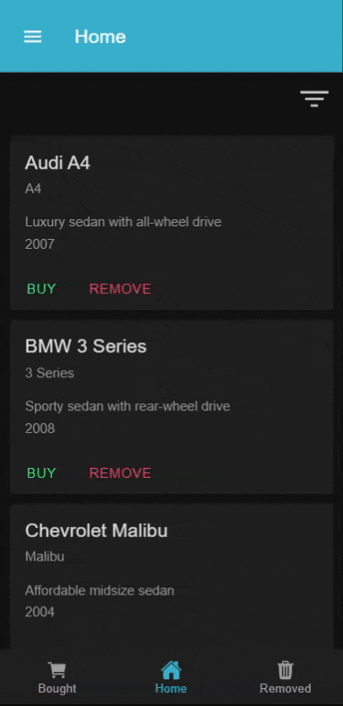

# Ionic React Car Catalog

This is a mobile app built using the Ionic Framework (ReactJS) that allows users to browse through a catalog of cars and buy or remove them from the feed. The app includes a side menu and a footer navigation bar.

## Usage

The app has three main tabs: Home, Bought Cars, and Removed Cars. The Home tab displays a feed of cars in the form of cards, each containing the name, description, model, and year of the car. The user can filter the cars by year by clicking on the "Filter" button, which opens a popup.

Each card also has a "BUY" button and a "REMOVE" button. Clicking the "BUY" button marks the car as bought and moves it to the Bought Cars tab. Clicking the "REMOVE" button marks the car as removed from the feed and moves it to the Removed Cars tab.

The app also has a side menu that contains the same three pages as the footer navigation.

The user's data (i.e., bought and removed cars) is persistent, meaning that even if the app is closed and re-opened, the changes made by the user will remain the same.

| Demo | 
| -----------------| 
|  |

## Installation

To run the app locally, you need to have Node.js and npm installed on your machine. Clone this repository and navigate to the project directory. Then run the following commands:

```bash
npm install
ionic serve
```

